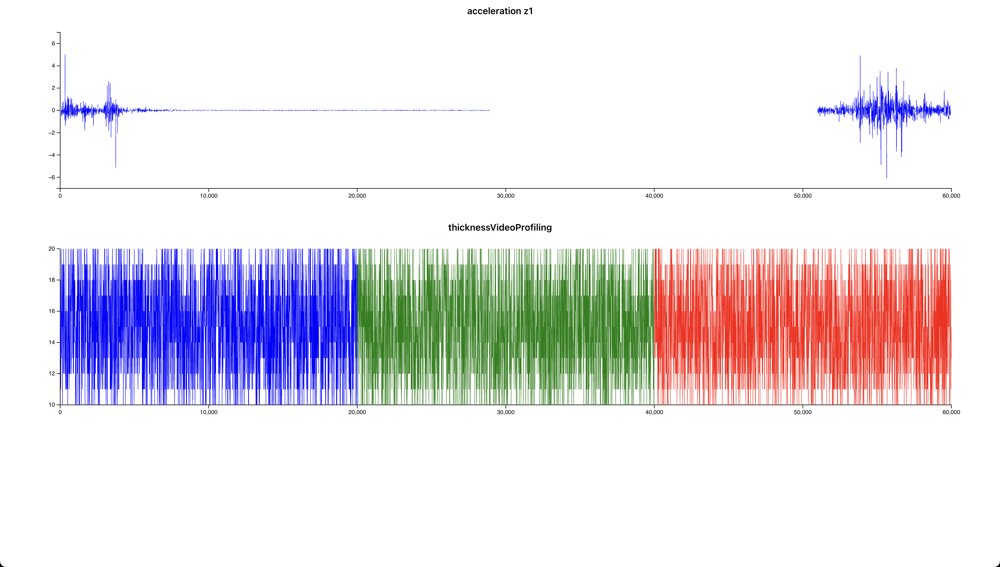

# Chart Test Application

A React application for visualizing time-series data with D3.js charts.

## Screenshot

The application displays two time-series plots:
- **Top Plot**: "acceleration z1" - Shows acceleration values over time with periods of activity and inactivity
- **Bottom Plot**: "thicknessVideoProfiling" - Shows thickness measurements with color-coded segments (blue, green, red)

## Features

- Interactive time-series visualization using D3.js
- Support for multiple data series with different colors
- Responsive chart design
- Automatic axis scaling and formatting

## Available Scripts

### `npm i && npm start`

Runs the app in development mode.\
Open [http://localhost:3000](http://localhost:3000) to view it in your browser.

### `npm run build`

Builds the app for production to the `build` folder.

### `npm test`

Launches the test runner in interactive watch mode.

## Technologies Used

- React
- D3.js
- Create React App
